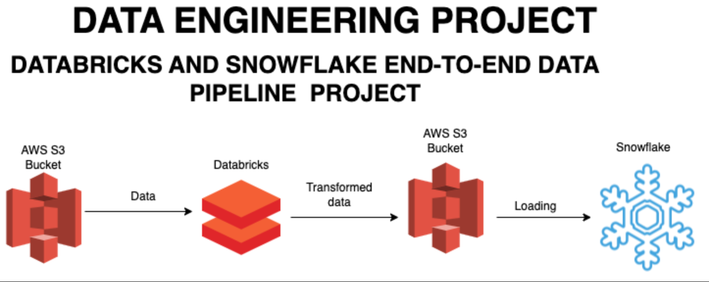

# End-to-End-Data-Project-Using-Databrick

In this project, I build an end-to-end data pipeline using AWS, Databricks, Pyspark and Snowflake.

# Data source

- Amazon Products Sales Dataset 2023

source : https://www.kaggle.com/datasets/lokeshparab/amazon-products-dataset?resource=download
